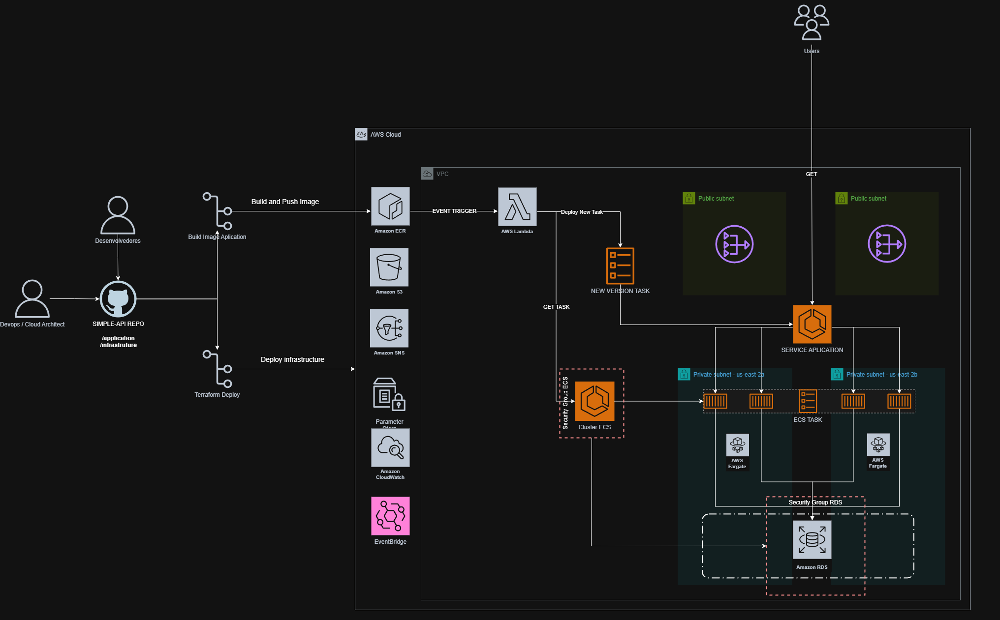
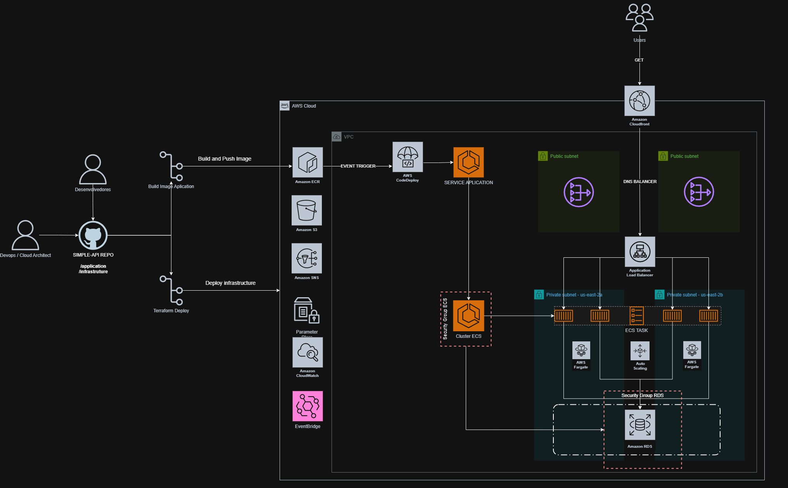

# simple-api

## Descrição
Uma API em Node.js utilizando o Express Framework que realiza a conexão com um banco de dados PostgreSQL.

## Como utilizar
O comando para iniciar a API é **npm run start**

## Rotas
| Rota | Método | Descrição |
| --- | --- | --- |
/ | GET | Retorna uma mensagem estática.
/connect | GET | Realiza a conexão com o banco e retorna a versão da engine.

## Variáveis de Ambiente
| Nome | Description  | Padrão |
| --- |  --- |  --- |
API_PORT | Port da API Node | 3000
DB_DATABASE | Database do banco de dados | 
DB_HOST | Endereço do banco de dados | 
DB_PORT | Port do banco de dados | 5432
DB_USER | Usuário do banco de dados | 
DB_PASSWORD | Senha do banco de dados | 

## Arquitetura e Infraestrutura

A infraestrutura deste projeto foi concebida seguindo os pilares de **Segurança, Eficiência de Custos e Confiabilidade** do *AWS Well-Architected Framework*. Toda a provisão foi feita via **Terraform (IaC)**.

### Topologia de Entrega 

###### Considerando restrições de quota para provisionamento de Load Balancers em contas novas da AWS, foi adotada uma estratégia de entrega que, mantém os princípios de automação, segurança e eficiência operacional.

* **Deploy via Event-Driven:** Substituição do fluxo padrão do CodeDeploy por uma **AWS Lambda**, disparada por eventos do **EventBridge**, responsável por executar um **Force New Deployment** no ECS de forma assíncrona.

* **Exposição Controlada para Validação:** Para viabilizar testes funcionais, foi criada uma exposição direta via serviço com **IP público**, mantendo a aplicação 100% **Stateless**.

* **Otimização de Custos (FinOps):** Utilização de **ECS Fargate Spot**, reduzindo em até 70% o custo computacional.  
  Como a aplicação não demanda controle de sistema operacional ou customização de instância, a adoção de EC2 não se justifica neste cenário, reduzindo significativamente o overhead operacional (patching, hardening, gestão de SO e capacidade).
---

### Topologia Ideal 

Arquitetura projetada para garantir alta disponibilidade, escalabilidade automática e segurança em camadas, seguindo boas práticas do AWS Well-Architected Framework.

* **Edge & Performance:** Uso de Amazon CloudFront como camada de distribuição global, reduzindo latência e permitindo integração com WAF para proteção adicional.

* **Balanceamento e Alta Disponibilidade:** Application Load Balancer em subnets públicas distribuindo tráfego entre múltiplas tasks em diferentes Availability Zones.

* **Escalabilidade Horizontal:** Serviço no Amazon ECS (Fargate) com política de Auto Scaling baseada em métricas (CPU), ajustando automaticamente a quantidade de tasks conforme demanda.

* **Isolamento de Rede:** Aplicação executando em subnets privadas, sem exposição direta à internet.

* **Segurança de Dados:** Amazon RDS em subnet privada, acessível apenas via Security Group da aplicação.

## Pipeline CI/CD

O fluxo de entrega contínua foi desenhado para ser totalmente automatizado, seguro e desacoplado, separando claramente o ciclo de infraestrutura do ciclo de aplicação.

* ##  Build & Push da Aplicação

Disparado automaticamente a cada `push` na branch `main` com alterações no diretório `application/`.

**Responsabilidades do workflow:**

    - Autenticação segura na AWS via OIDC (sem uso de credenciais estáticas)
    - Build da imagem Docker
    - Geração de tag baseada no commit (`GITHUB_SHA`)
    - Push da imagem versionada para o **Amazon ECR**

Esse processo garante:

    - Imagens imutáveis
    - Rastreabilidade por commit
    - Segurança na autenticação 
    - Separação clara entre código e infraestrutura

* ## Provisionamento de Infraestrutura (Terraform)

Executado manualmente via `workflow_dispatch`, permitindo controle por ambiente e módulo.

**Características do pipeline:**

    - Autenticação via OIDC
    - Execução modular (connectivity, security, databases, application)
    - Backend remoto versionado por ambiente
    - Uso de arquivos `.auto.tfvars` específicos por ambiente

A estrutura modular permite:

    - Isolamento de responsabilidades
    - Deploy incremental por camada
    - Reutilização para múltiplos ambientes e contas

* ## Deploy Event-Driven da Aplicação

Após o push de uma nova imagem no ECR:

1. O evento é capturado pelo **Amazon EventBridge**
2. Uma **AWS Lambda** é acionada
3. A Lambda executa um `Force New Deployment` no ECS Service
4. O ECS:
   - Cria novas tasks com a imagem atualizada
   - Realiza health checks
   - Finaliza gradualmente as tasks antigas

Esse modelo garante:

- Deploy assíncrono e resiliente
- Zero intervenção manual
- Rolling update controlado
- Alta disponibilidade durante a atualização

* ## Arquitetura da Pipeline

    -  **Zero credenciais estáticas** (OIDC)
    -  **Imagens imutáveis**
    -  **Deploy desacoplado via eventos**
    -  **Infraestrutura modular**
    -  **Separação entre ciclo de app e ciclo de infra**

Essa abordagem mantém o ambiente:

    - Reprodutível
    - Auditável
    - Escalável
    - Seguro    
    - Alinhado a boas práticas de DevSecOps

---

## 🛠️ Stack Tecnológica
* **Aplicação:** Node.js (Express)
* **Banco de Dados:** PostgreSQL (Amazon RDS)
* **Deploy via Event-Driven (Lambda) :** PostgreSQL (Amazon RDS)
* **IaC:** Terraform
* **Container:** Docker (Amazon ECR + ECS Fargate)
* **CI/CD:** GitHub Actions